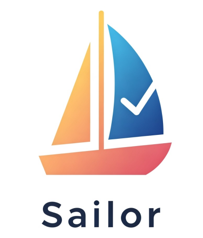

    

> ⚠️ **Warning**: This project is in active development and may undergo frequent breaking changes. The API, features, and functionality are not yet stable and may change significantly between versions. Please use with caution in production environments.

# Sailor
## Features
- Notes and Tasks in a single environment
- Include Zettelkasten note context alongside your task list
- Local-first, plain text format: notes in markdown, tasks in json
- Built on proven tooling with robust interfaces
- Cross-platform support
- Tauri is cool
- Svelte is cool
- In Rust We Trust

## Motivation
I work in a terminal most of the day, and I've enjoyed using tools like vimwiki, taskwarrior, and taskwiki to take notes, plan, brainstorm, and track any related (or unrelated) tasks. I also like the simplicity and portability of plain text formats where a simple service like SyncThing can seamlessly sync data across multiple devices (for free!). However, when I leave work and want to access my data on mobile, I have no easy way of doing that. I've tried combinations of Obsidian, Acreom, Todoist, and TaskWarrior (mobile)... unfortunately none of them combine notes and tasks quite like taskwiki, and if I want to keep using taskwarrior on terminal, doing integration and sync is at best a complicated effort. I want to satisfy all 3 conditions in a single application:
- Notes and tasks together, where tasks can be created _inside notes_ arbitrarily, and the original context for a task can be easily referenced and linked to.
- Local-first, plain text format, so that I can sync across devices using SyncThing (or optionally some other cloud service)
- Cross-platform
And for what it's worth, I think it's very possible! Read on for the architectural vision.

## Architectural Proof
- Build on top of unix philosophy tools:
  - zk for note management
  - taskwarrior for task management
  - don't reinvent the wheel, just integrate them and provide an interface
  - retain the ability for users to get the same experience on any terminal (ie. features are not baked into some gui/app/website)
- Use Taskwarrior's robust json interface to essentially use json as a plain text backend
- Inspired by taskwiki and Acreom, use a simple text id tag on task items to create and track the note-task association
- Tauri 2.0 to develop cross-platform

## Design goals
- Retain unix philosophy where possible - provide same experience on terminal as in the app
- Not sure how far I want to go yet on rich markdown interactions, there's a lot to cover and I'm not trying to compete with funded projects

## Roadmap
- [ ] Proof of concept:
  - [ ] editor proof of concept
  - [ ] taskwarrior backend proof of concept
  - [ ] zk backend proof of concept
  - [ ] mobile proof of concept
- [ ] simple, functional, pretty UI/UX
- [ ] calendar task interactions

## Tech Stack
- [zk](https://github.com/zk-org/zk)
- [taskwarrior](https://taskwarrior.org/)
- [rust](https://www.rust-lang.org/)
- [tauri 2.0](https://tauri.app/)
- [svelte](https://svelte.dev/)
- [typescript](https://www.typescriptlang.org/)
- [SyncThing](https://syncthing.net/)

## Alternatives | Inspiration | Related
Notetaking:
- [Obsidian](https://obsidian.md/)
- [zk.nvim](https://github.com/zk-org/zk.nvim)
- [zk](https://github.com/zk-org/zk)
- [vimwiki](https://github.com/vimwiki/vimwiki)
- [markview.nvim](https://github.com/OXY2DEV/markview.nvim)
- [obsidian.nvim](https://github.com/epwalsh/obsidian.nvim)
- [mkdnflow](https://github.com/jakewvincent/mkdnflow.nvim)

Task Management:
- [Superlist](https://www.superlist.com)
- [Todoist](https://todoist.com/)
- [taskwarrior](https://taskwarrior.org/)
- [taskwarrior-flutter](https://github.com/CCExtractor/taskwarrior-flutter) (mobile)

Task-Note Integration:
- [taskwiki](https://github.com/tools-life/taskwiki)
- [Acreom](https://github.com/acreom/acreom)
- [workflowy](https://www.workflowy.com/)
- [m_taskwarrior_d.nvim](https://github.com/huantrinh1802/m_taskwarrior_d.nvim) - like taskwiki, but without reliance on vimwiki
- org mode
- neorg (no tasks yet)
- AppFlowy
- AnyType
- Notion

## Maybe someday
- convert to Norg editor to compliment neorg  ?

## Contributing

## License
MIT
